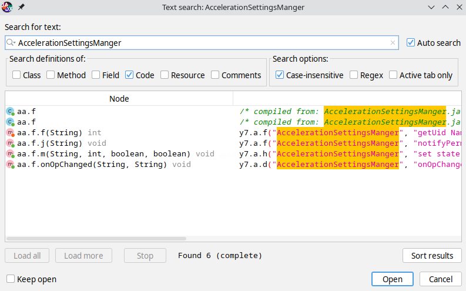
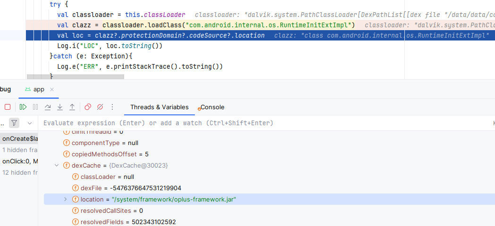

# 0x0 入手点
可以看到有设置选项，尝试切换（以firefox nightly 为例, package name = `org.mozilla.fenix`）：
```
SP.AccelerationUtils    com.oplus.securitypermission         I  addUserSetPackage success: package=org.mozilla.fenix, userId=0  // 我以前没设置过
SP.AccelerationSettingsManger  com.oplus.securitypermission         I  set state: uid=10352, pkg=org.mozilla.fenix, userId=0, state=0  // 允许
SP.AccelerationSettingsManger  com.oplus.securitypermission         I  set state: uid=10352, pkg=org.mozilla.fenix, userId=0, state=3  // 6s
SP.AccelerationSettingsManger  com.oplus.securitypermission         I  set state: uid=10352, pkg=org.mozilla.fenix, userId=0, state=1 // 不允许
```
可以看到，这个是由 `com.oplus.securitypermission` 发出的log，那么这个包是什么呢
```
❯ adb -d shell pm path com.oplus.securitypermission
package:/system_ext/app/SecurityPermission/SecurityPermission.apk
```

顺着我们就能找到 APK,正好一加 ROOT 方便，这边直接拿走文件进行解析
```
❯ adb -d pull /system_ext/app/SecurityPermission/SecurityPermission.apk
❯ md5sum SecurityPermission.apk
1ed3009e6f49d50801b8b4ab44ecdfe2  SecurityPermission.apk
```

# 0x1 SecurityPermission.apk
还记得上面 Log 的 TAG `AccelerationSettingsManger` 吗，总所周知， TAG 这东西一般都是写死的字符串常量，我们直接在 JADX 里面进行搜索

诶，这不就找到了，下面是代码选取的部分
```java
package aa;

import android.app.AppOpsManager;
import android.content.BroadcastReceiver;
import android.content.Context;
import android.content.Intent;
import android.content.IntentFilter;
import android.content.pm.ApplicationInfo;
import android.content.pm.PackageInfo;
import android.content.pm.PackageManager;
import android.net.Uri;
import android.os.UserHandle;
import android.text.TextUtils;
import java.util.ArrayList;
import java.util.Iterator;
import java.util.concurrent.ConcurrentHashMap;

/* compiled from: AccelerationSettingsManger.java */
/* loaded from: classes2.dex */
public class f implements AppOpsManager.OnOpChangedListener {

    /* renamed from: g, reason: collision with root package name */
    private static final f f193g = new f();

    /* renamed from: a, reason: collision with root package name */
    private boolean f194a;

    /* renamed from: c, reason: collision with root package name */
    private Context f196c;

    /* renamed from: e, reason: collision with root package name */
    private AppOpsManager f198e;

    /* renamed from: b, reason: collision with root package name */
    private final ConcurrentHashMap<String, Integer> f195b = new ConcurrentHashMap<>();

    /* renamed from: d, reason: collision with root package name */
    private ArrayList<PackageManager.OnPermissionsChangedListener> f197d = new ArrayList<>();

    /* renamed from: f, reason: collision with root package name */
    private final BroadcastReceiver f199f = new a();

    /* compiled from: AccelerationSettingsManger.java */
    /* loaded from: classes2.dex */
    class a extends BroadcastReceiver {
        a() {
        }

        @Override // android.content.BroadcastReceiver
        public void onReceive(Context context, Intent intent) {
            String action = intent.getAction();
            Uri data = intent.getData();
            if (data == null) {
                return;
            }
            String schemeSpecificPart = data.getSchemeSpecificPart();
            if ("android.intent.action.PACKAGE_REMOVED".equals(action) && !intent.getBooleanExtra("android.intent.extra.REPLACING", false)) {
                f.this.f195b.remove(schemeSpecificPart);
            }
        }
    }

    private f() {
    }

    public static f c() {
        return f193g;
    }

    private int f(String str) {
        try {
            return this.f196c.getPackageManager().getPackageUidAsUser(str, UserHandle.myUserId());
        } catch (PackageManager.NameNotFoundException e10) {
            y7.a.f("AccelerationSettingsManger", "getUid NameNotFoundException = " + e10.getMessage());
            return -1;
        }
    }

    private synchronized void i(int i10) {
        Iterator<PackageManager.OnPermissionsChangedListener> it = this.f197d.iterator();
        while (it.hasNext()) {
            it.next().onPermissionsChanged(i10);
        }
    }

    public synchronized void b(PackageManager.OnPermissionsChangedListener onPermissionsChangedListener) {
        if (!this.f197d.contains(onPermissionsChangedListener)) {
            this.f197d.add(onPermissionsChangedListener);
        }
    }

    public void d(Context context) {
        ApplicationInfo applicationInfo;
        this.f195b.clear();
        for (PackageInfo packageInfo : context.getPackageManager().getInstalledPackagesAsUser(0, context.getUserId())) {
            if (packageInfo != null && (applicationInfo = packageInfo.applicationInfo) != null) {
                int i10 = applicationInfo.uid;
                boolean isSystemApp = applicationInfo.isSystemApp();
                if (i10 >= 10000 && !isSystemApp) {
                    String str = packageInfo.packageName;
                    this.f195b.put(str, Integer.valueOf(this.f198e.unsafeCheckOpRawNoThrow(10002, i10, str)));
                }
            }
        }
    }

    public int e(String str) {
        if (f(str) < 0) {
            return 3;
        }
        Integer num = this.f195b.get(str);
        if (num == null) {
            num = Integer.valueOf(this.f198e.unsafeCheckOpRawNoThrow(10002, f(str), str));
            this.f195b.put(str, num);
        }
        return num.intValue();
    }

    public void g(Context context) {
        this.f196c = context;
        boolean C = n.C(context);
        this.f194a = C;
        if (C) {
            this.f198e = (AppOpsManager) context.getSystemService("appops");
            IntentFilter intentFilter = new IntentFilter();
            intentFilter.addAction("android.intent.action.PACKAGE_REMOVED");
            intentFilter.addDataScheme("package");
            this.f196c.registerReceiver(this.f199f, intentFilter, 2);
            d(context);
            this.f198e.startWatchingMode(10002, (String) null, this);
        }
    }

    public boolean h() {
        return this.f194a;
    }

    public void j(String str) {
        try {
            ApplicationInfo applicationInfo = this.f196c.getPackageManager().getPackageInfo(str, 0).applicationInfo;
            if (applicationInfo != null) {
                i(applicationInfo.uid);
            }
        } catch (PackageManager.NameNotFoundException e10) {
            y7.a.f("AccelerationSettingsManger", "notifyPermissionsChanged NameNotFoundException = " + e10.getMessage());
        }
    }

    public synchronized void k(PackageManager.OnPermissionsChangedListener onPermissionsChangedListener) {
        this.f197d.remove(onPermissionsChangedListener);
    }

    public void l(String str, int i10) {
        m(str, i10, true, true);
    }

    public void m(String str, int i10, boolean z10, boolean z11) {
        if (!TextUtils.isEmpty(str) && f(str) >= 0) {
            if (z11) {
                j(str);
            }
            Integer num = this.f195b.get(str);
            if (num == null || num.intValue() != i10) {
                this.f195b.put(str, Integer.valueOf(i10));
                if (z10) {
                    this.f198e.setUidMode(10002, f(str), i10);
                    this.f198e.setMode(10002, f(str), str, i10);
                    n.h(this.f196c, str);
                    y7.a.h("AccelerationSettingsManger", "set state: uid=" + f(str) + ", pkg=" + str + ", userId=" + UserHandle.myUserId() + ", state=" + i10);
                }
            }
        }
    }

    @Override // android.app.AppOpsManager.OnOpChangedListener
    public void onOpChanged(String str, String str2) {
        int f10 = f(str2);
        if (f10 < 0) {
            return;
        }
        int unsafeCheckOpRawNoThrow = this.f198e.unsafeCheckOpRawNoThrow(10002, f10, str2);
        if (unsafeCheckOpRawNoThrow != e(str2)) {
            m(str2, unsafeCheckOpRawNoThrow, false, true);
        }
        y7.a.d("AccelerationSettingsManger", "onOpChanged: pkg=" + str2 + ", uid=" + f10 + ", userId=" + UserHandle.myUserId());
    }
}
```
我们不用管看不看得懂，直接看到有 log 的那句
```java
public void m(String str, int i10, boolean z10, boolean z11) {
        if (!TextUtils.isEmpty(str) && f(str) >= 0) {
            if (z11) {
                j(str);
            }
            Integer num = this.f195b.get(str);
            if (num == null || num.intValue() != i10) {
                this.f195b.put(str, Integer.valueOf(i10));
                if (z10) {
                    this.f198e.setUidMode(10002, f(str), i10);
                    this.f198e.setMode(10002, f(str), str, i10);
                    n.h(this.f196c, str);
                    y7.a.h("AccelerationSettingsManger", "set state: uid=" + f(str) + ", pkg=" + str + ", userId=" + UserHandle.myUserId() + ", state=" + i10);
                }
            }
        }
    }
```
看到
```java
private AppOpsManager f198e;
...
this.f198e.setMode(10002, f(str), str, i10);
```
如果你对设置权限这些的熟悉，其实能看出来这就是[这里](https://android.googlesource.com/platform/frameworks/base/+/master/core/java/android/app/AppOpsManager.java#8328)
```java
/** @hide */
@UnsupportedAppUsage
@TestApi
@RequiresPermission(android.Manifest.permission.MANAGE_APP_OPS_MODES)
    public void setMode(int code, int uid, String packageName, @Mode int mode) {
        try {
            mService.setMode(code, uid, packageName, mode);
        } catch (RemoteException e) {
            throw e.rethrowFromSystemServer();
        }
    }
```
那可以去查询吗，很可惜不行，因为唯一一个能用 `int op` 查询的方法 `public int checkOpNoThrow(int op, int uid, String packageName)` 是 
```
Landroid/app/AppOpsManager;->checkOpNoThrow(IILjava/lang/String;)I,unsupported
Landroid/app/AppOpsManager;->checkOpNoThrow(IILjava/lang/String;Ljava/lang/String;I)I,blocked
```
而我们的目标是 Android 15，那有什么办法可以避免调用 hidden api 呢

当然有，`public int checkOpNoThrow(@NonNull String op, int uid, @NonNull String packageName)` 就为我们准备了 API,现在的问题是， op 的 `String` 要从哪里来

# 0x2 framework.jar
既然这里用了 `ApplicationInfo`，那么 `framework.jar` 里面肯定有它的实现，这个类一定就认识这个 `op`，那看看这个类怎么实现的

先对 `10002` 进行搜索，虽然没搜到，但是找到了
```java
public static String opToPermission(int op) {
    if (op > 10000) {
        return APP_OPS_MANAGER_EXT.getCustomOpToPermission(op);
    }
    return sAppOpInfos[op].permission;
}
```
这个 EXT 又是什么呢
```java
private static final IAppOpsManagerExt APP_OPS_MANAGER_EXT = (IAppOpsManagerExt) ExtLoader.type(IAppOpsManagerExt.class).create();
```
可以看到是一个 `IAppOpsManagerExt`，这个类里面又有什么
```java
public interface IAppOpsManagerExt {
    public static final int CUSTOM_NUM_OP = 10003;
    public static final int OP_CUSTOM_NONE = 10000;
    public static final int OP_DIRECTION_SENSORS = 10002;
    public static final int OP_GET_INSTALLED_APPS = 10001;
    public static final int[] sCustomOpToSwitch = {10001, 10002};
    public static final String OPSTR_GET_INSTALLED_APPS = "android:get_installed_apps";
    public static final String OPSTR_DIRECTION_SENSORS = "android:direction_sensors";
    public static final String[] sCustomOpToString = {OPSTR_GET_INSTALLED_APPS, OPSTR_DIRECTION_SENSORS};
    public static final String[] sCustomOpNames = {"GET_INSTALLED_APPS", "DIRECTION_SENSORS"};
    public static final int[] sCustomRuntimeOps = {10001, 10002};
    public static final String[] sCustomOpPerms = {"com.android.permission.GET_INSTALLED_APPS", null};
    public static final String[] sCustomOpRestrictions = {null, null};
    public static final AppOpsManager.RestrictionBypass[] sCustomOpAllowSystemRestrictionBypass = {null, null};
    public static final int[] sCustomOpDefaultMode = {3, 3};
    public static final boolean[] sCustomOpDisableReset = {false, false};
    public static final HashMap<String, Integer> sCustomOpStrToOp = new HashMap<String, Integer>() { // from class: android.app.IAppOpsManagerExt.1
        {
            put(IAppOpsManagerExt.OPSTR_GET_INSTALLED_APPS, 10001);
            put(IAppOpsManagerExt.OPSTR_DIRECTION_SENSORS, 10002);
        }
    };
}
```
看来已经找到了 String 的表示法 `android:direction_sensors`，从这里就可以去查询我们是否被设置了6s

<!--
# 0x3 oplus-framework.jar
但是要找这6s是如何实现的依然不简单，继续关注log
```
SystemSensorManagerExtImpl             uk.kagurach.kagura               V  RegisterListener bmi26x Gyroscope Non-wakeup type:4 delay:200000us by uk.kagurach.kagura.Splash$sensorListener$1@bf7e2c9 from uk.kagurach.kagura
```
这个 `SystemSensorManagerExtImpl` 就很可疑，看上去就很像在这里实现了对传感器的操作。当然直接找肯定不行，我们先去找 `SystemSensorManager`
```java
public class SystemSensorManager extends SensorManager {
    private static ISystemSensorManagerExt mSystemSensorManagerExt = (ISystemSensorManagerExt) ExtLoader.type(ISystemSensorManagerExt.class).create();
}
```
然后 Ext 中定义了一些方法，看得出来其中不少和设置 delay 有关（`registerListenerImplHook`）
```java
public interface ISystemSensorManagerExt {
    default boolean registerListenerImplHook(Context context, SensorEventListener listener, Sensor sensor, int delayUs) {
        return false;
    }

    default boolean unregisterListenerImplHook(SensorEventListener listener, Sensor sensor) {
        return false;
    }

    default SensorEvent dispatchEventDataAdjust(SensorEventListener listener, Sensor sensor, SensorEvent events) {
        SensorEvent defaultEvent = new SensorEvent(events.values.length);
        return defaultEvent;
    }

    default SensorEvent dispatchSensorEventHook(SensorEventListener listener, Sensor sensor, SensorEvent events, boolean inMirage, int cmdArgs, Context context) {
        return events;
    }

    default void dispatchSensorEventEnd(int res, int handle, float[] values, int accuracy, int type, int cmdArgs, String client) {
    }

    default void printSensorListenersWhileExceededLocked(Context context, HashMap<SensorEventListener, SystemSensorManager.SensorEventQueue> sensorListeners) {
    }

    default void enableSensorStatsLog(int enbale, int handler, int sensorType, String opPackageName, String packageName) {
    }

    default void sensorDispatchEventStasLog(SensorEvent event, float[] values) {
    }
}
```
但很可惜，我们在这里是看不到是怎么实现的，那我们去看看 Ext 是怎么加载的
```java
// system.ext.loader.core.ExtLoader
public T create() {
    if (ExtRegistry.size() == 0) {
        try {
            Class.forName("com.android.internal.os.RuntimeInitExtImpl").getMethod("preload", ClassLoader.class).invoke(null, getClass().getClassLoader());
        } catch (Exception e) {
            Log.e(ExtLoader.TAG, "invoke RuntimeInitExtImpl fail", e);
        }
        if (ExtRegistry.size() > 0) {
            return create();
        }
    }
}
```
现在我们就需要去找到 `com.android.internal.os.RuntimeInitExtImpl` 在哪里了

虽然看上去这个做法挺弱智的，但却是做到了（是在调试器里面找到的`dexCache -> location`），反正就是在 `/system/framework/oplus-framework.jar` 这个文件，复制出来看看
```java
public static void preload(ClassLoader preloadClassLoader) {
        if (preloadClassLoader == null) {
            preloadClassLoader = RuntimeInitExtImpl.class.getClassLoader();
        }
        for (String preloadClass : PRELOAD_CLASSES) {
            try {
                Class.forName(preloadClass, true, preloadClassLoader);
            } catch (ClassNotFoundException e) {
                Log.w(TAG, "Class not found for extloader");
            } catch (UnsatisfiedLinkError e2) {
                Log.w(TAG, "Problem preloading " + preloadClass + ": " + e2);
            } catch (Throwable t) {
                Log.e(TAG, "Error preloading " + preloadClass + ".", t);
                if (t instanceof Error) {
                    throw ((Error) t);
                }
                if (t instanceof RuntimeException) {
                    throw ((RuntimeException) t);
                }
                throw new RuntimeException(t);
            }
        }
    }
```
可以看到 `preload` 方法是用的自己的 classLoader， 那大概率真正的实现也在这个 jar 里，去找找，果然在 `android.hardware.SystemSensorManagerExtImpl` 找到了实现
```java
package android.hardware;

import android.app.ActivityThread;
import android.app.IOplusCompactWindowAppManager;
import android.common.OplusFeatureCache;
import android.content.Context;
import android.hardware.SystemSensorManager;
import android.os.Handler;
import android.os.SystemProperties;
import android.util.Log;
import com.aiunit.aon.AonSmartRotation;
import com.oplus.android.internal.util.OplusFrameworkStatsLog;
import java.util.HashMap;

/* loaded from: classes.dex */
public class SystemSensorManagerExtImpl implements ISystemSensorManagerExt {
    private static final boolean DEBUG_DYNAMIC_SENSOR = false;
    private static final float FLOAT_DIFF = 0.0f;
    private static final int MESSAGE_WHAT = 1001;
    private static final int POST_DELAYED_INTERVEL = 5000;
    private static final int SENSOR_VALUE_STEP = 100;
    private static final int STATSLOG_CONSTANT = 1;
    private static final String TAG = "SystemSensorManagerExtImpl";
    public static final int TYPE_PEDOMETER_MINUTE = 33171034;
    public static boolean sInZoomWindow;
    private int mSensorEnableStatus;
    private float mSensorEventValueLight;
    private SensorEvent mSensorevent;
    private Handler mTimerHandler;
    public static float mLastStep = 0.0f;
    public static float mPedoLastStep = 0.0f;
    public static int MAX_STEP_INTERVAL = 100;
    public static AonSmartRotation mAonSmartRotation = null;
    public static boolean haveAonSmartRotation = false;
    public static float hardwareValue = 0.0f;
    public static int mLastSmartRotationStatus = 0;
    public static int mCurrentSmartRotationStatus = 0;
    private static float sSensorEventValueLight = 1.0f;
    private static long sTimestamp = 0;
    private static int sOldProxStatus = 1;
    private static int sProxStatus = 1;
    private static boolean sStepDectorFlag = false;
    private Runnable mTimerThread = new Runnable() { // from class: android.hardware.SystemSensorManagerExtImpl.1
        @Override // java.lang.Runnable
        public void run() {
            SystemSensorManagerExtImpl.sStepDectorFlag = false;
            long duration = SystemSensorManagerExtImpl.this.mSensorevent.timestamp - SystemSensorManagerExtImpl.sTimestamp;
            OplusFrameworkStatsLog.write(100098, SystemSensorManagerExtImpl.sTimestamp, SystemSensorManagerExtImpl.this.mSensorevent.timestamp, duration, SystemSensorManagerExtImpl.this.mSensorevent.sensor.getHandle());
        }
    };
    public IOplusCompactWindowAppManager mCompactWindowAppManager = OplusFeatureCache.getOrCreate(IOplusCompactWindowAppManager.DEFAULT, new Object[0]);

    public SystemSensorManagerExtImpl(Object base) {
    }

    public boolean registerListenerImplHook(Context context, SensorEventListener listener, Sensor sensor, int delayUs) {
        if (listener != null) {
            if (sensor == null) {
                Log.v(TAG, "RegisterListener by " + listener.toString() + " from " + context.getPackageName());
            } else {
                Log.v(TAG, "RegisterListener " + sensor.getName() + " type:" + sensor.getType() + " delay:" + delayUs + "us by " + listener.toString() + " from " + context.getPackageName());
            }
            if (listener.getClass().getName() != null && listener.getClass().getName().indexOf("com.tencent.beacon") != -1) {
                Log.w(TAG, "Block tencent beacon for using sensor.");
                return true;
            }
        }
        if (sensor != null) {
            try {
                if (sensor.getType() == 27 && mAonSmartRotation == null) {
                    haveAonSmartRotation = SystemProperties.get("persist.sys.oplus.smartrotation", "false").equals("true");
                    if (haveAonSmartRotation) {
                        mAonSmartRotation = new AonSmartRotation(context);
                        if (listener != null) {
                            Log.d(TAG, "SmartRotationDebug, Init AonSmartRotation by " + listener.toString());
                            return false;
                        }
                        return false;
                    }
                    return false;
                }
                return false;
            } catch (Exception e) {
                Log.e(TAG, "SmartRotation got exception, e = " + e.toString());
                return false;
            }
        }
        return false;
    }

    public boolean unregisterListenerImplHook(SensorEventListener listener, Sensor sensor) {
        if (listener != null) {
            if (sensor != null) {
                Log.v(TAG, "unRegisterListener by " + listener.toString() + " and its name is " + sensor.getName());
            } else {
                Log.v(TAG, "unRegisterListener by " + listener.toString());
            }
        }
        if (sensor != null) {
            try {
                if (sensor.getType() == 27 && mAonSmartRotation != null) {
                    mAonSmartRotation = null;
                    if (listener != null) {
                        Log.d(TAG, "SmartRotationDebug, Destroy AonSmartRotation by " + listener.toString());
                        return false;
                    }
                    return false;
                }
                return false;
            } catch (Exception e) {
                Log.e(TAG, "SmartRotation got exception, e = " + e.toString());
                return false;
            }
        }
        return false;
    }

    private boolean blockDispatchEvent(SensorEventListener listener, Sensor sensor, SensorEvent events) {
        if (sensor == null || sensor.getType() != 27 || events.values[0] <= 4.0d) {
            return sensor != null && (sensor.getType() == 27 || sensor.getType() == 8 || sensor.getType() == 1) && sInZoomWindow;
        }
        return true;
    }

    private boolean needToAdjustEvent(SensorEventListener listener, Sensor sensor, SensorEvent events) {
        if (sensor == null) {
            return false;
        }
        try {
            if (sensor.getType() == 19) {
                if (mLastStep == 0.0f || Math.abs(events.values[0] - mLastStep) >= MAX_STEP_INTERVAL) {
                    Log.v(TAG, "step counter dispatchSensorEvent step " + events.values[0] + " to + " + listener);
                    mLastStep = events.values[0];
                }
            } else if (sensor.getType() == 33171034 && (mPedoLastStep == 0.0f || Math.abs(events.values[0] - mPedoLastStep) >= MAX_STEP_INTERVAL)) {
                Log.v(TAG, "Pedometer minute step counter dispatchSensorEvent step " + events.values[0] + " to + " + listener);
                mPedoLastStep = events.values[0];
            }
        } catch (Exception e) {
            Log.e(TAG, "step counter error e = " + e.toString());
        }
        return sensor.getType() == 27 && haveAonSmartRotation && mAonSmartRotation != null;
    }

    public SensorEvent dispatchEventDataAdjust(SensorEventListener listener, Sensor sensor, SensorEvent events) {
        if (sensor != null) {
            try {
                if (sensor.getType() == 27 && haveAonSmartRotation && mAonSmartRotation != null) {
                    mCurrentSmartRotationStatus = mAonSmartRotation.getStatus();
                    if (mCurrentSmartRotationStatus != mLastSmartRotationStatus) {
                        if (mCurrentSmartRotationStatus == 1) {
                            Log.d(TAG, "SmartRotationDebug, SmartRotation switch On.");
                            mAonSmartRotation.createSmartRotationConnection();
                        } else if (mCurrentSmartRotationStatus == 0) {
                            Log.d(TAG, "SmartRotationDebug, SmartRotation switch Off.");
                            mAonSmartRotation.destroySmartRotationConnection();
                        } else {
                            Log.w(TAG, "SmartRotationDebug, SmartRotation switch Invalid, reset Status value.");
                            mCurrentSmartRotationStatus = 0;
                            mLastSmartRotationStatus = 0;
                        }
                    }
                    mLastSmartRotationStatus = mCurrentSmartRotationStatus;
                    hardwareValue = events.values[0];
                    events.values[0] = mAonSmartRotation.makeDecisionBySmartRotation(events.values);
                    if (hardwareValue != events.values[0]) {
                        Log.d(TAG, "SmartRotationDebug, Device Orientation changed by SmartRotation, t.value[0] is " + events.values[0] + ", and Hardware Value is " + hardwareValue + "to: " + listener);
                    }
                }
            } catch (Exception e) {
                Log.e(TAG, "SmartRotation got exception, e = " + e.toString());
            }
        }
        return events;
    }

    public SensorEvent dispatchSensorEventHook(SensorEventListener listener, Sensor sensor, SensorEvent events, boolean inMirage, int cmdArgs, Context context) {
        SensorEvent t = events;
        int type = sensor != null ? sensor.getType() : -1;
        if (needToAdjustEvent(listener, sensor, events)) {
            t = dispatchEventDataAdjust(listener, sensor, events);
        }
        if (blockDispatchEvent(listener, sensor, events)) {
            t = null;
        }
        if (inMirage) {
            t = null;
        }
        if (cmdArgs == 1) {
            Log.d(TAG, "dispatchSensorEventHook newEvent=" + t + ",oldEvent=" + events + ",type=" + type + ",sInZoomWindow=" + sInZoomWindow + ",inMirage=" + inMirage + ",listener=" + listener);
        }
        if (!ActivityThread.isSystem() && this.mCompactWindowAppManager != null && this.mCompactWindowAppManager.blockOrientationSensorEventInCompactWindowMode(context, sensor.getType(), ActivityThread.currentPackageName())) {
            return null;
        }
        return t;
    }

    public void dispatchSensorEventEnd(int res, int handle, float[] values, int accuracy, int type, int cmdArgs, String client) {
        if (cmdArgs == 1) {
            Log.d(TAG, "dispatchSensorEvent_end  reportedRes=" + res + ",type=" + type + ",handle=data[" + values[0] + "," + values[1] + "," + values[2] + "],accuracy=" + accuracy + handle + ",client=" + client);
        }
    }

    public void printSensorListenersWhileExceededLocked(Context context, HashMap<SensorEventListener, SystemSensorManager.SensorEventQueue> sensorListeners) {
        if (sensorListeners != null) {
            HashMap<SensorEventListener, SystemSensorManager.SensorEventQueue> listeners = new HashMap<>(sensorListeners);
            Log.e(TAG, "sensorListeners exceeded, size = " + listeners.size() + " in " + context.getPackageName());
            for (SensorEventListener l : listeners.keySet()) {
                Log.e(TAG, "listener : " + l.toString());
            }
        }
    }

    public void enableSensorStatsLog(int enbale, int handler, int sensorType, String opPackageName, String packageName) {
        switch (sensorType) {
            case 5:
            case 8:
            case 18:
            case 19:
            case 30:
                if (this.mSensorEnableStatus != enbale) {
                    this.mSensorEnableStatus = enbale;
                    OplusFrameworkStatsLog.write(100038, handler, opPackageName, sensorType, packageName, enbale, this.mSensorEventValueLight);
                    return;
                }
                return;
            default:
                return;
        }
    }

    public void sensorDispatchEventStasLog(SensorEvent event, float[] values) {
        float max = event.sensor.getMaximumRange();
        switch (event.sensor.getType()) {
            case 5:
                this.mSensorEventValueLight = Math.round((values[0] * 100.0f) / max);
                if (Math.abs(sSensorEventValueLight - this.mSensorEventValueLight) > 1.0f) {
                    sSensorEventValueLight = this.mSensorEventValueLight;
                    OplusFrameworkStatsLog.write(100039, event.sensor.getName(), event.sensor.getType(), event.accuracy, this.mSensorEventValueLight);
                    return;
                }
                return;
            case 8:
                float distance = values[0];
                if (distance >= 0.0f && distance < max) {
                    sProxStatus = 1;
                } else {
                    sProxStatus = 0;
                }
                if (sOldProxStatus != sProxStatus) {
                    sOldProxStatus = sProxStatus;
                    OplusFrameworkStatsLog.write(100039, event.sensor.getName(), event.sensor.getType(), event.accuracy, values[0]);
                    return;
                }
                return;
            case 18:
            case 19:
                this.mSensorevent = event;
                if (this.mTimerHandler == null) {
                    this.mTimerHandler = new Handler();
                }
                if (!sStepDectorFlag) {
                    sTimestamp = event.timestamp;
                    sStepDectorFlag = true;
                    this.mTimerHandler.postDelayed(this.mTimerThread, 1001, 5000L);
                    return;
                } else {
                    this.mTimerHandler.removeMessages(1001);
                    this.mTimerHandler.postDelayed(this.mTimerThread, 1001, 5000L);
                    return;
                }
            default:
                return;
        }
    }
}
```
可以看到在
```java
private boolean blockDispatchEvent(SensorEventListener listener, Sensor sensor, SensorEvent events) {
        if (sensor == null || sensor.getType() != 27 || events.values[0] <= 4.0d) {
            return sensor != null && (sensor.getType() == 27 || sensor.getType() == 8 || sensor.getType() == 1) && sInZoomWindow;
        }
        return true;
    }
```
```java
if (blockDispatchEvent(listener, sensor, events)) {
            t = null;
        }
```
这里对传感器进行了屏蔽，然后在 `framework.jar` 里
```java
// android.hardware.SystemSensorManager
@Override // android.hardware.SystemSensorManager.BaseEventQueue
protected int dispatchSensorEvent(int handle, float[] values, int inAccuracy, long timestamp, int cmdArgs) {
    Sensor sensor = (Sensor) this.mManager.mHandleToSensor.get(Integer.valueOf(handle));
    if (sensor == null) {
        return -1;
    }
    synchronized (this.mSensorsEvents) {
        try {
            SensorEvent t = this.mSensorsEvents.get(handle);
            try {
                if (t == null) {
                    return -2;
                }
                System.arraycopy(values, 0, t.values, 0, t.values.length);
                t.timestamp = timestamp;
                t.accuracy = inAccuracy;
                t.sensor = sensor;
                int accuracy = this.mSensorAccuracies.get(handle);
                if (t.accuracy >= 0 && accuracy != t.accuracy) {
                    this.mSensorAccuracies.put(handle, t.accuracy);
                    this.mListener.onAccuracyChanged(t.sensor, t.accuracy);
                }
                t.firstEventAfterDiscontinuity = false;
                if (t.sensor.getType() == 37) {
                    int lastCount = this.mSensorDiscontinuityCounts.get(handle);
                    int curCount = Float.floatToIntBits(values[6]);
                    if (lastCount >= 0 && lastCount != curCount) {
                        this.mSensorDiscontinuityCounts.put(handle, curCount);
                        t.firstEventAfterDiscontinuity = true;
                    }
                }
                SensorEvent t2 = SystemSensorManager.mSystemSensorManagerExt.dispatchSensorEventHook(this.mListener, sensor, t, SensorManager.mInMirage, cmdArgs, this.mManager.mContext);
                if (t2 == null) {
                    return -3;
                }
                this.mListener.onSensorChanged(t2);
                SystemSensorManager.mSystemSensorManagerExt.sensorDispatchEventStasLog(t2, values);
                return 1;
            } catch (Throwable th) {
                th = th;
                while (true) {
                    try {
                        break;
                    } catch (Throwable th2) {
                        th = th2;
                    }
                }
                throw th;
            }
        } catch (Throwable th3) {
            th = th3;
        }
    }
}
```
就不能获取到 Event 了

再仔细看判断是否要屏蔽传感器 Event 的代码，可以看出只有 `sInZoomWindow` 这里是可能会变化的，那这个是怎么来的呢
```java
// android.app.OplusActivityThreadExtImpl
private void setZoomSensorState(boolean isZoom) {
    Slog.d("ActivityThread", "setZoomSensorState: isZoom " + isZoom);
    SystemSensorManagerExtImpl.sInZoomWindow = isZoom;
}
```
那谁来调用呢
```java
// android.app.OplusActivityThreadExtImpl
public boolean onTransact(int code, Parcel data, Parcel reply, int flags) {
    switch (code) {
        case 10005:
            data.enforceInterface(IOplusApplicationThread.DESCRIPTOR);
            boolean on = 1 == data.readInt();
            setZoomSensorState(on);
            return true;
    }
}
```
可以看到这是用一个 `Parcel data` 里面读出来的

再往上看，看看启动流程的hook,不难注意到
```java
// android.app.OplusActivityThreadExtImpl
public void handleLaunchActivity() {
    this.mLaunchActivityStartTime = System.nanoTime();
    try {
        OplusActivityManager.getInstance().setSceneActionTransit("", "OSENSE_ACTION_ACTIVITY_START", 600);
    } catch (Exception ex) {
        Log.e("ActivityThread", "Exception = " + ex);
    }
}
```
这不就正好6秒，然后找 caller
```java
// android.app.OplusActivityManager
public void setSceneActionTransit(String scene, String action, int timeout) throws RemoteException {
    if (getService() != null) {
        getService().setSceneActionTransit(scene, action, timeout);
    } else {
        Log.e(TAG, "setSceneActionTransit failed because service has not been created");
    }
}
```
然后再去找
```java
// android.app.IOplusActivityManager
public static final String DESCRIPTOR = "android.app.IOplusActivityManager";
```
case 112: // 注：上面还有一个  return "setSceneActionTransit";
    String _arg093 = data.readString();
    String _arg158 = data.readString();
    int _arg223 = data.readInt();
    data.enforceNoDataAvail();
    setSceneActionTransit(_arg093, _arg158, _arg223);
    return true;
```
这都开始 RPC Call 了我是真找不到了就这样吧
-->

## 小米
米系的逆向也不是太复杂，在小米自己的framework里，可以看到 opCode 10000~10051 被拼成了 `MIUI:$opCode` 的样子，所以可以直接通过遍历大法找到是哪个 opCode, ~~这个作为课后练习大家自己去看~~