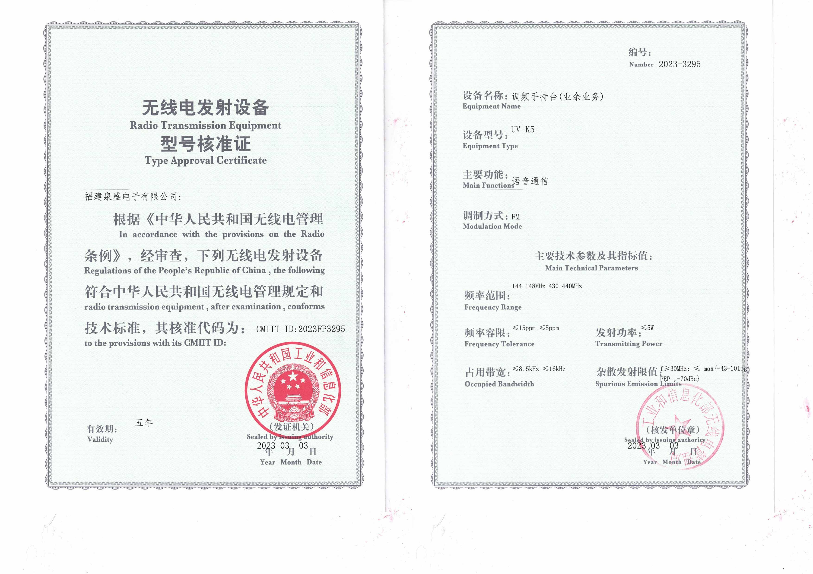

简单来说，需要的东西都差不多

<!-- more -->

TLDR：你需要下面的东西
- 你的身份证复印件
- 你的操作证复印件
- 无线电发射设备型号核准证
- 设台表格
- 申请书

## 证件复印件
这个很明显，就是把你的证件正反面复印下，黑白不限

## 核准证
和**西安市要求不同**，对于有核准证设备，这里不需要设备照片等（当然最好你把设备带上），而需要的是这样的核准证（据说西安只需要能看到 CMIIT ID 和 SN 的照片）

类似这个




## 设台表格
没什么特别的，注意这边最好是 2024 版本，可以看西安市发的文件（西安无线电通信学会 公众号）

## 申请书
就是下面的格式，写的内容正常即可
```
陕西省无线电管理委员办公室：
我是xxx，身份证xxx，要设置业余台，...
```
然后落款你的电话号码，名字，记得签字

## 最后
当完成后，将上面材料（最好本人）交给他们即可，会先告诉你呼号（一周多），然后再寄送（可能要很久）