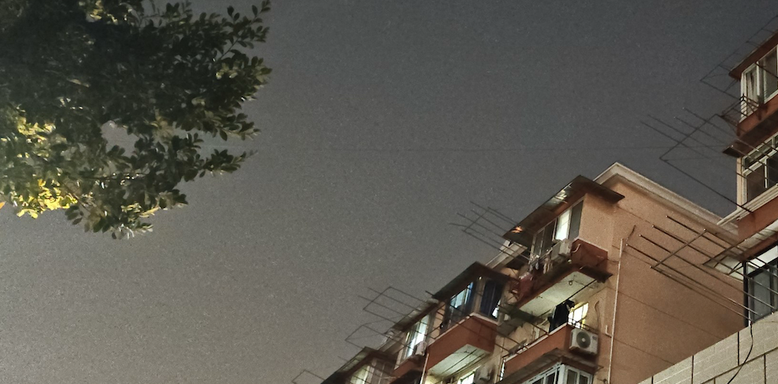

Hi,我是 Kagura 🏳️‍⚧️

- 大学生（目前还是）
- 现在在做安卓开发，虽然我觉得 Kotlin 很好，但主要还是在写 Java
- I use nix/NixOS，另外在 Arch/MacOS 上用 nix 管理包难道不好吗
- 喜欢写一点乱七八糟的小工具，做一些乱七八糟的东西

### 联系方式
- Mail to: me [at] kagurach.uk
- [Telegram](https://kagurachu.t.me)

### PGP Key:
[f01a2af4257476a3020cb8705b6499b9489504f3](https://keyserver.ubuntu.com/pks/lookup?search=f01a2af4257476a3020cb8705b6499b9489504f3&fingerprint=on&op=index)

### DN42:
> 由于中国移动长期对上行的阻塞导致 BGP 大量 flap，目前暂停使用
- `AS 4242422323`
- Region = `CN` （确切来说就是上海）
- IPV6 only （我没有公网 V4）

### 业余无线电
使用呼号 `BI9CWR`，泉盛 UV-K5，钻石 770 拉杆天线或钻石 770H 天线配吸盘底座

我的朋友放了一个短波台给我玩，使用20米端馈
每晚看着划破天空的天线，就想到它带来了远方~~老朴、民乐和✨✨广播电台~~Ham的声音。

一般活跃在上海 AA 中继

## 广告
要不要来成为被选中的 ~~马猴烧酒~~ 🐧烧酒

同学你好，腾讯校园招聘启动，快复制我的内推串码 `B8TGP0PU` ，登录官网([https://join.qq.com/index.html](https://join.qq.com/index.html))粘贴并投递简历吧!
